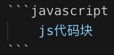

`Markdown`是一种纯文本格式的标记语言。通过简单的标记语法，它可以使普通文本内容具有一定的格式.
他有很多优点:
- 只要是支持`markdown`语法的编辑器都可以直接拿来写文章,很方便
- 通过使用一些简单的语法就可以实现很好看的排版,还是很不错的
- `markdown`语法上手很简单,五分钟学会
- 很多在线写作平台都支持`markdown`
- 最后一点:特别适合程序员写博客!

下面简单学习一下`markdown`几个常用的语法
### 1.标题
在想要设置为标题的文字前面加#来表示:<br/>
一个#是一级标题，二个#是二级标题，以此类推。支持六级标题。
```markdown
# 1级标题
## 2级标题
### 3级标题
#### 4级标题
##### 5级标题
```
# 1级标题
## 2级标题
### 3级标题
#### 4级标题
##### 5级标题

<!--more-->

### 2.字体
- 两个星号包住就是加粗
- 一个星号包住就是斜体
- 三个星号包住就是加粗斜体
- 两个波浪号包住就是删除线

```markdown
**这是加粗的文字**
*这是倾斜的文字*`
***这是斜体加粗的文字***
~~这是加删除线的文字~~
```
效果如下所示:

**这是加粗的文字**<br/>
*这是倾斜的文字*<br/>
***这是斜体加粗的文字***<br/>
~~这是加删除线的文字~~<br/>

### 3.引用
在需要引用的文字前面加上`>`就可以了
```markdown
>加班还是不加班,这是一个问题   -鲁迅
```
效果:

>加班还是不加班,这是一个问题.   -鲁迅

(鲁迅表示这话我没说过...Orz...)

### 4.分割线
使用三个星号或者三个横杠都可以实现,
```markdown
华丽丽的分割线:
---
***
```
效果:

---
***

### 5.图片
```markdown

```
效果:


### 6.超链接
超链接和图片很类似,就是没有开头的`!(感叹号)`
```markdown
[百度一下,你就知道](https://baidu.com)
```
效果:

[百度一下,你就知道](https://baidu.com)

### 7.列表
列表分为`有序列表`和`无序列表`:
```markdown
- 1.item1
  - item1-1
    - item1-1-1
      - item1-1-1-1
- 2.item2
  - item2-1
  - item2-2
    - item2-2-1

- item1
```
效果:

有序列表:
- 1.item1
  - item1-1
    - item1-1-1
      - item1-1-1-1
- 2.item2
  - item2-1
  - item2-2
    - item2-2-1

无序列表:
- item1
  - item1-1

建议列表不要嵌套的太深.

### 8.表格
表格也是很常用的一个语法,形如
```markdown
TITLE|DESC
--|--
姓名|allenliu
性别|男
```
效果:

TITLE|DESC
--|--|
姓名|allenliu
性别|男

### 9.字符高亮
使用`键盘esc下面的反点(名称叫做:间隔符)来包裹`

```markdown
`高亮的文本`
```

效果:

HELLO,`markdown`!

### 10.代码块
下面是大杀器,对于程序员来说非常好用的一个东西,就是代码块.
使用三个间隔符和要包裹代码的语言开始,以三个间隔符结尾.中间塞入你的代码:

形如:



效果:

```html
<div>
    <p>hello,markdown!</p>
</div>
```

```javascript
console.log('awsome markdown!');
```

```css
.p{
    color:'red'
}
```

上面就是`markdown`最高频的语法了,当然还有很多高级用法,例如:`流程图`,`甘特图`,`数学公式`等等高级功能,但是这些因为平时不是很常用,需要的时候查一下就可以了.

[查询更多markdown高级用法,戳这里](http://note.youdao.com/iyoudao/?p=2411&vendor=unsilent14)
<link rel="stylesheet" href="https://unpkg.com/gitalk/dist/gitalk.css">
<script src="https://unpkg.com/gitalk@latest/dist/gitalk.min.js"></script> 

<div id="gitalk-container"></div>     
<script type="text/javascript">
    var gitalk = new Gitalk({
    // gitalk的主要参数
      clientID: `e4890482436f9cd96039`,
      clientSecret: `0425bf39d0c5cdedf4ae60a72fbd7a3d58d7d99e`,
      repo: `codeCheeseIssues`,
      owner: 'wawsc5354524',
      admin: ['wawsc5354524'],
      id: 'markdown-m10n',
        });
      gitalk.render('gitalk-container');
</script>